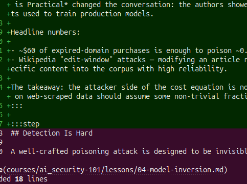

Out the door by 7. Take the path along the canal as far as the lock keeper's cottage. Coffee from the little place by the bridge. Home by 9 if I want to get any writing done.

If it's raining, swap for the museum loop and the second-hand bookstore on Carter Street.

 7. Take the path along the canal as far as the lock keeper's cottage. Coffee from the little place by the bridge. Home by 9 if I want to get any writing done.

/home/t3rmit3/Pictures/Screenshots/Screenshot From 2026-04-28 18-26-01.png

Paste:  
Drag and drop:

